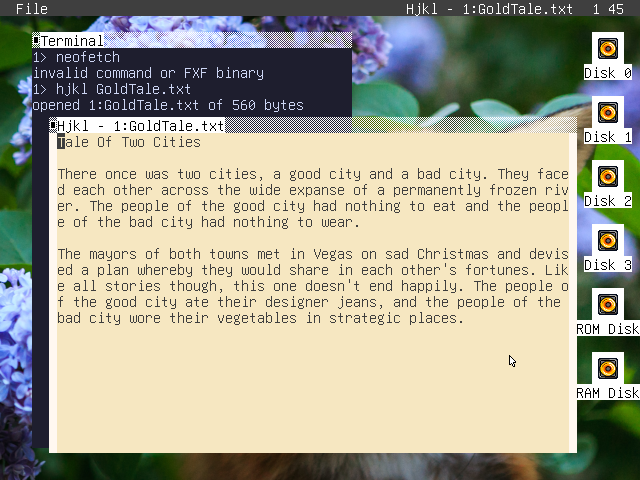

# Hjkl

A humble text editor for [fox32os](https://github.com/fox32-arch/fox32os) written in Jackal.



# Tutorial

Hjkl can be invoked in the shell, like so:

```
0> 1:hjkl 0:startup.bat
```

The `N:` syntax specifies the disk ID of the file or application, and can be elided if it is in the currently selected disk.

Hjkl is a non-modal editor, which means typing a character immediately inserts that character at the cursor, and other commands require special keys or keybinds to perform. We use `C-p` to represent holding the Ctrl key while pressing the P key.

- `C-p` or `Up`: move cursor up
- `C-n` or `Down`: move cursor down
- `C-f` or `Right`: move cursor right
- `C-b` or `Left`: move cursor left
- `C-a`: move cursor to start of line
- `C-e`: move cursor to end of line
- `C-u`: scroll up
- `Backspace`: delete character before cursor
- `C-d`: delete character at cursor
- `C-s`: save file
- `C-c`: quit

# Building and Running

Hjkl can be built with Make, requires variables `JACKAL` (Jackal compiler), `XRASM` (assembler), `XRLINK` (linker), and RTLLIB (statically linked library of Jackal's standard library), all from the [XR/station SDK](https://github.com/xrarch/newsdk). The `run` convenience recipe also requires variables `RYFS`, `FOX32`, and `FOX32OS`.
