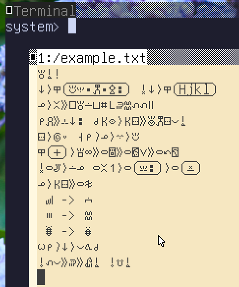

# Hjkl: pali tu pi suno sama

A branch dedicated to editing toki pona's sitelen pona script seamlessly with latin script.

# toki pona Input Method

A new command `C-<backtick>` allows switching between regular typing and toki pona typing.

When typing toki pona...

- Typing one of lowercase `aeijklmnopstuw` (all toki pona letters) adds that character to an invisible buffer, which is matched to the first possible toki pona word. The current word is reflected by the character under the cursor. If no word matches, then the last typed letter is shown instead.
- Typing `Backspace` will delete the last character from the buffer. If the buffer is empty, it will delete a character at the cursor as normal.
- Typing `Esc` will clear this buffer.
- Typing `Space` or `Tab` will "publish" the current word in the buffer, writing it to the text file and allowing further words to be written. If there is no matching word, then the plaintext letters are written instead. Pressing `Space` while the buffer is empty will insert a space as normal.
- Typing a backtick or tilde will behave the same, except it will use the alternate writing of the word if one exists. Currently supported alternate glyphs are the four-legged "akesi", the secular "sewi", and the numeric "mute".
- Typing `Enter` will behave the same, except it will always write the plaintext.
- Typing any other character publishes the current word and then types that character after it as normal.

Some keys are remapped to different characters:

- The `[` and `]` keys now type cartouche characters, oval shapes which extend across characters and allow writing foreign words in toki pona.
- The `.` key now types a middle dot.
- The `:` key now types a thicker colon matching the middle dot character.

As an example, typing "mi jan[ol:]" will give you the characters: "mi", "jan", opening cartouche, "olin", thick colon, closing cartouche.

Hjkl does not support combining glyphs. The one exception is the combination of "toki" and "pona", which is available as a special character written as "tokipona".

# Technical Design

Because Hjkl currently assumes one byte equals one character, we have to use the upper 128 bytes that ASCII doesn't use. This gives us enough to represent all the nimi pu, punctuation, plus a couple extra. We also use the control characters besides NUL, line break, and DEL. We can probably use NUL and DEL if need be. A good text editor would user the UCSUR encodings instead.
